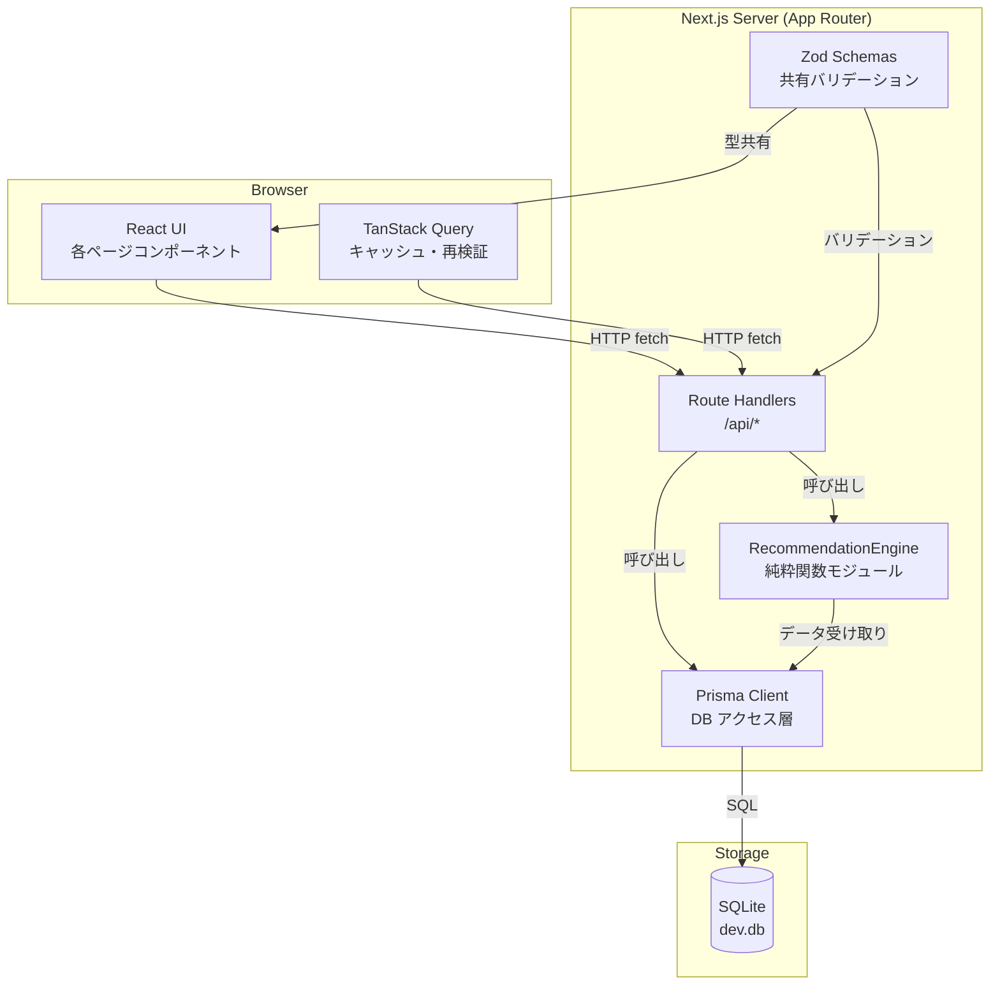
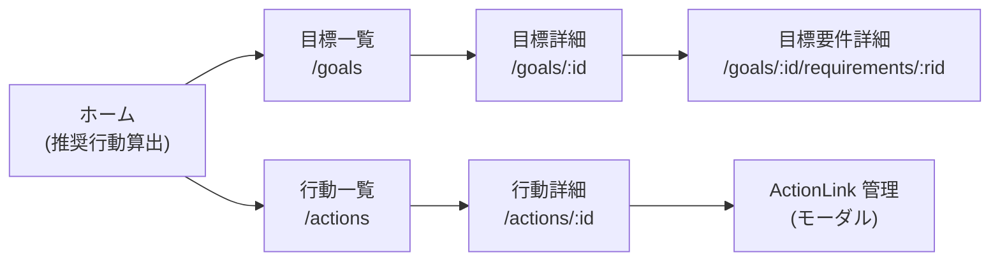

# Design Document

## Overview

Goal Network App は、複数の人生目標（Goal）と日々の行動（Action）を関連付け、限られた時間の中で最大3件の推奨行動を毎日提案するシングルユーザー向け Web アプリケーションである。

### 設計方針

- **シンプルなモノリシック構成**: シングルユーザー・ローカルまたは単一テナント運用を前提とし、外部サービスへの依存を最小化する
- **型安全性の一貫**: TypeScript を全層で使用し、Prisma によるスキーマ駆動の型生成でランタイムエラーを抑制する
- **ビジネスロジックの分離**: RecommendationEngine を純粋関数として実装し、テスト容易性と保守性を確保する
- **設定値の外部化**: UrgencyFactor 係数・CrossGoalBonus 係数・NormalizedDuration 基準時間等をすべて `src/lib/scoring-config.ts` に集約し、1か所の変更で全体に反映できるようにする。環境変数や管理画面からの動的変更はMVP対象外とし、変更が必要な場合はこのファイルを直接編集する

---

## Architecture

### 技術スタック

| レイヤー | 採用技術 | 選定理由 |
|---------|---------|---------|
| フロントエンド | Next.js 15 (App Router) + TypeScript | SSR/CSR 双方に対応、API Routes でバックエンドも同一プロジェクトに同居可能 |
| UI コンポーネント | shadcn/ui + Tailwind CSS | アクセシビリティ対応済みのコンポーネント群、カスタマイズ性が高い |
| サーバー状態管理 | TanStack Query v5 | キャッシュ・再検証・楽観的更新を宣言的に管理 |
| バックエンド | Next.js Route Handlers (App Router) | フロントエンドと同一リポジトリでデプロイを単純化 |
| ORM | Prisma v6 | TypeScript 型安全なクエリ、マイグレーション管理 |
| データベース | SQLite | ローカル実行・デモ用途を前提として採用。追加インフラ不要で単一ファイルのためバックアップが容易。将来的に公開運用へ移行する場合はPostgreSQL等のサーバーDBへの移行を想定する |
| バリデーション | Zod | スキーマ定義をフロント・バック両方で共有 |
| テスト | Vitest + fast-check | PBT（プロパティベーステスト）対応、Vitest は Next.js と相性が良い |

### コンポーネント図



### ディレクトリ構成

```
goal-network-app/
├── src/
│   ├── app/
│   │   ├── (pages)/
│   │   │   ├── goals/            # 目標一覧・詳細
│   │   │   ├── actions/          # 行動一覧・詳細
│   │   │   └── recommendations/  # 推奨行動算出
│   │   └── api/
│   │       ├── goals/
│   │       ├── goal-requirements/
│   │       ├── actions/
│   │       ├── action-links/
│   │       ├── completion-records/
│   │       ├── available-daily-time/
│   │       └── recommendations/
│   ├── lib/
│   │   ├── prisma.ts             # Prisma クライアントシングルトン
│   │   ├── recommendation-engine.ts  # 純粋関数群
│   │   ├── scoring-config.ts     # 係数・閾値の定数定義
│   │   └── progress.ts           # 進捗率算出ロジック
│   ├── schemas/
│   │   └── index.ts              # 共有 Zod スキーマ
│   └── components/
│       ├── ui/                   # shadcn/ui 生成コンポーネント
│       ├── goals/
│       ├── actions/
│       └── recommendations/
├── prisma/
│   ├── schema.prisma
│   └── migrations/
└── tests/
    ├── unit/
    └── property/                 # fast-check PBT
```

---

## Components and Interfaces

### RecommendationEngine インターフェース

RecommendationEngine は **純粋関数モジュール** として実装する。DB アクセスはすべて Route Handler 側で行い、計算に必要なデータを引数として受け取る設計とする。これにより、モックなしでユニットテスト・プロパティテストが可能になる。

```typescript
// src/lib/scoring-config.ts
// MVP における係数管理方針:
// - すべての係数・閾値をこのファイルに集約し、1か所の変更で全体に反映できるようにする
// - 環境変数・管理画面からの動的変更はMVP対象外
// - 将来的に動的変更が必要になった場合はDB管理や環境変数対応への移行を想定する
export const SCORING_CONFIG = {
  urgencyFactor: {
    overdue: 3.0,       // 期限切れ
    within7Days: 2.0,   // 0〜7日以内
    within30Days: 1.5,  // 8〜30日以内
    noDeadline: 1.0,    // 期限なし
  },
  urgencyThresholds: {
    immediate: 7,       // 日数
    near: 30,           // 日数
  },
  crossGoalBonus: {
    oneGoal: 1.0,
    twoGoals: 1.1,
    threeOrMoreGoals: 1.2,
  },
  normalizedDurationBase: 30,  // 分
  maxRecommendations: 3,
  maxCandidates: 10,
} as const;
```

```typescript
// src/lib/recommendation-engine.ts

export type WeightLevel = 'HIGH' | 'MEDIUM' | 'LOW';

export const WEIGHT_VALUES: Record<WeightLevel, number> = {
  HIGH: 3,
  MEDIUM: 2,
  LOW: 1,
};

export interface ActionLinkInput {
  targetGoalId: number;          // GoalRequirement の場合は親 Goal の ID
  contributionWeight: WeightLevel;
  goalImportance: WeightLevel;
}

export interface ActionInput {
  id: number;
  requiredMinutes: number;
  deadline: Date | null;
  actionType: 'TASK' | 'HABIT';
  actionLinks: ActionLinkInput[];
  activeGoalIds: number[];       // ActionLink 先の Status=Active な Goal ID 一覧（重複なし）
}

export interface ScoringBreakdown {
  linkBreakdowns: { goalId: number; importanceWeight: number; contributionWeight: number; product: number }[];
  sumImportanceContribution: number;
  uniqueActiveGoalCount: number;
  crossGoalBonus: number;
  urgencyFactor: number;
  normalizedDuration: number;
  priorityScore: number;
}

export interface ScoredAction {
  actionId: number;
  requiredMinutes: number;
  priorityScore: number;
  breakdown: ScoringBreakdown;
}

export interface RecommendationResult {
  recommendations: ScoredAction[];
  totalRequiredMinutes: number;
  remainingMinutes: number;
}

// 主要関数シグネチャ
export function calcNormalizedDuration(requiredMinutes: number): number;
export function calcUrgencyFactor(deadline: Date | null, today: Date): number;
export function calcCrossGoalBonus(uniqueActiveGoalCount: number): number;
export function calcPriorityScore(action: ActionInput, today: Date): ScoringBreakdown;
export function selectRecommendations(
  candidates: ScoredAction[],
  availableMinutes: number,
  config?: typeof SCORING_CONFIG
): RecommendationResult;
```

### 推奨選定アルゴリズム（擬似コード）

```typescript
function selectRecommendations(candidates: ScoredAction[], availableMinutes: number): RecommendationResult {
  // Step 1: PriorityScore 降順で最大 10 件に絞り込む
  const top10 = candidates
    .sort((a, b) => b.priorityScore - a.priorityScore)
    .slice(0, SCORING_CONFIG.maxCandidates);

  // Step 2: 最大 3 件の組み合わせを列挙（C(10,1) + C(10,2) + C(10,3) = 175 通り以下）
  const combos = generateCombinations(top10, 1, SCORING_CONFIG.maxRecommendations);

  // Step 3: 時間制約を満たす組み合わせを絞り込む
  const validCombos = combos.filter(
    combo => combo.reduce((sum, a) => sum + a.requiredMinutes, 0) <= availableMinutes
  );

  if (validCombos.length === 0) return { recommendations: [], totalRequiredMinutes: 0, remainingMinutes: availableMinutes };

  // Step 4: 優先順位で最良の組み合わせを選定
  const best = validCombos.sort((a, b) => {
    // (1) PriorityScore 合計降順
    const scoreA = a.reduce((s, x) => s + x.priorityScore, 0);
    const scoreB = b.reduce((s, x) => s + x.priorityScore, 0);
    if (scoreB !== scoreA) return scoreB - scoreA;

    // (2) ユニーク Active Goal 数降順
    const goalsA = new Set(a.flatMap(x => x.breakdown.linkBreakdowns.map(l => l.goalId))).size;
    const goalsB = new Set(b.flatMap(x => x.breakdown.linkBreakdowns.map(l => l.goalId))).size;
    if (goalsB !== goalsA) return goalsB - goalsA;

    // (3) 合計時間昇順
    const timeA = a.reduce((s, x) => s + x.requiredMinutes, 0);
    const timeB = b.reduce((s, x) => s + x.requiredMinutes, 0);
    return timeA - timeB;
  })[0];

  const total = best.reduce((s, x) => s + x.requiredMinutes, 0);
  return { recommendations: best, totalRequiredMinutes: total, remainingMinutes: availableMinutes - total };
}
```

### Progress Calculator インターフェース

```typescript
// src/lib/progress.ts

export interface GoalProgressInput {
  directTaskActions: { id: number; isCompleted: boolean }[];
  requirementTaskActions: { id: number; isCompleted: boolean }[];  // 全 GoalRequirement 分
}

// UNION DISTINCT で重複排除してから進捗率を算出
export function calcGoalProgress(input: GoalProgressInput): number {
  const allUnique = new Map<number, boolean>();
  for (const a of [...input.directTaskActions, ...input.requirementTaskActions]) {
    if (!allUnique.has(a.id)) allUnique.set(a.id, a.isCompleted);
  }
  const total = allUnique.size;
  if (total === 0) return 0;
  const completed = [...allUnique.values()].filter(Boolean).length;
  return Math.floor((completed / total) * 100);
}

export function calcRequirementProgress(taskActions: { id: number; isCompleted: boolean }[]): number {
  if (taskActions.length === 0) return 0;
  const completed = taskActions.filter(a => a.isCompleted).length;
  return Math.floor((completed / taskActions.length) * 100);
}
```

### API ルートの主要エンドポイント

| メソッド | パス | 説明 |
|--------|-----|------|
| GET | `/api/goals` | Goal 一覧（クエリ: `?status=ACTIVE\|ON_HOLD\|COMPLETED`） |
| POST | `/api/goals` | Goal 新規作成 |
| GET | `/api/goals/:id` | Goal 詳細（進捗率・Habit 実行回数を含む） |
| PATCH | `/api/goals/:id` | Goal 更新 |
| DELETE | `/api/goals/:id` | Goal + 関連 ActionLink 削除 |
| GET | `/api/goals/:id/requirements` | GoalRequirement 一覧 |
| POST | `/api/goals/:id/requirements` | GoalRequirement 新規作成 |
| PATCH | `/api/goal-requirements/:id` | GoalRequirement 更新 |
| DELETE | `/api/goal-requirements/:id` | GoalRequirement + 関連 ActionLink 削除 |
| GET | `/api/actions` | Action 一覧（クエリ: `?status=`, `?type=TASK\|HABIT`） |
| POST | `/api/actions` | Action 新規作成 |
| GET | `/api/actions/:id` | Action 詳細（ActionLink・CompletionRecord 最新100件を含む） |
| PATCH | `/api/actions/:id` | Action 更新 |
| DELETE | `/api/actions/:id` | Action + ActionLink + CompletionRecord 削除 |
| GET | `/api/actions/:id/links` | ActionLink 一覧 |
| POST | `/api/actions/:id/links` | ActionLink 作成 |
| DELETE | `/api/action-links/:id` | ActionLink 削除 |
| POST | `/api/actions/:id/complete` | CompletionRecord 作成 |
| DELETE | `/api/completion-records/:id` | CompletionRecord 削除（完了取り消し） |
| GET | `/api/available-daily-time` | 当日の AvailableDailyTime 取得 |
| PUT | `/api/available-daily-time` | 当日の AvailableDailyTime UPSERT |
| POST | `/api/recommendations` | 推奨行動算出 |

#### Next.js 15 Route Handler の実装注意事項

**`params` は非同期（破壊的変更）:**
```typescript
// ❌ v14 以前（同期・NG）
export async function GET(
  request: Request,
  { params }: { params: { id: string } }
) {
  const id = params.id;
}

// ✅ v15（非同期・正しい）
type Params = Promise<{ id: string }>;

export async function GET(
  request: Request,
  segmentData: { params: Params }
) {
  const { id } = await segmentData.params;
}
```

**`headers()` は非同期（破壊的変更）:**
```typescript
// ❌ v14 以前（同期・NG）
import { headers } from 'next/headers';
const timezone = headers().get('X-Timezone');

// ✅ v15（非同期・正しい）
import { headers } from 'next/headers';
const headersList = await headers();
const timezone = headersList.get('X-Timezone') ?? 'UTC';
```

#### POST /api/recommendations リクエスト/レスポンス

```typescript
// Request
interface RecommendationRequest {
  availableMinutes: number;  // 1〜1440 の整数
}

// Response
interface RecommendationResponse {
  recommendations: {
    rank: number;                  // 1〜3
    action: {
      id: number;
      title: string;
      requiredMinutes: number;
      actionType: 'TASK' | 'HABIT';
      deadline: string | null;
    };
    priorityScore: number;
    relatedGoals: { id: number; title: string }[];
    relatedRequirements: { id: number; title: string }[];
    reasonText: string;            // テンプレート生成済みテキスト
    breakdown: ScoringBreakdown;
  }[];
  totalRequiredMinutes: number;
  remainingMinutes: number;
  noResultMessage?: string;        // 条件を満たす行動がない場合
}
```

### 推奨理由テキスト生成（バックエンド側）

推奨理由テキストはバックエンド（Route Handler）でテンプレートを基に生成し、フロントエンドは受け取ったテキストをそのまま表示する。

```typescript
function generateReasonText(action: ActionWithLinks, breakdown: ScoringBreakdown, today: Date): string {
  const parts: string[] = [];

  // 関連目標の数
  if (breakdown.uniqueActiveGoalCount >= 3) {
    parts.push(`${breakdown.uniqueActiveGoalCount}つの目標に貢献`);
  } else if (breakdown.uniqueActiveGoalCount === 2) {
    parts.push(`${breakdown.uniqueActiveGoalCount}つの目標に貢献`);
  }

  // 期限の緊急度
  if (action.deadline) {
    const daysLeft = Math.floor((action.deadline.getTime() - today.getTime()) / 86_400_000);
    if (daysLeft < 0) {
      parts.push(`期限切れ（${Math.abs(daysLeft)}日超過）`);
    } else {
      parts.push(`期限まで${daysLeft}日`);
    }
  }

  // 重要度の最高値
  const maxImportance = Math.max(...action.actionLinks.map(l => WEIGHT_VALUES[l.goalImportance]));
  if (maxImportance === 3) parts.push('重要度：高');
  else if (maxImportance === 2) parts.push('重要度：中');

  return parts.join(' / ') || '関連する目標への貢献行動';
}
```

---

## Data Models

### Prisma スキーマ

```prisma
// prisma/schema.prisma

datasource db {
  provider = "sqlite"
  url      = "file:./dev.db"
}

generator client {
  provider = "prisma-client"
  output   = "../src/generated/prisma"
}

// ── Enums ──────────────────────────────────────────────

enum Status {
  ACTIVE
  ON_HOLD
  COMPLETED
}

enum Importance {
  HIGH
  MEDIUM
  LOW
}

enum ContributionWeight {
  HIGH
  MEDIUM
  LOW
}

enum ActionType {
  TASK
  HABIT
}

// ActionLink のターゲット種別（Goal か GoalRequirement か）
enum LinkTargetType {
  GOAL
  GOAL_REQUIREMENT
}

// ── Models ─────────────────────────────────────────────

model Goal {
  id          Int       @id @default(autoincrement())
  title       String    // max 100 文字（アプリ側 Zod で検証）
  description String?   // max 1000 文字（任意）
  importance  Importance
  deadline    DateTime? // 日付のみ使用（時刻は無視）
  status      Status    @default(ACTIVE)
  createdAt   DateTime  @default(now())
  updatedAt   DateTime  @updatedAt

  requirements  GoalRequirement[]
  actionLinks   ActionLink[]       // target_type = GOAL のリンク
}

model GoalRequirement {
  id          Int      @id @default(autoincrement())
  goalId      Int
  title       String   // max 100 文字
  description String?  // max 500 文字（任意）
  status      Status   @default(ACTIVE)
  createdAt   DateTime @default(now())
  updatedAt   DateTime @updatedAt

  goal        Goal         @relation(fields: [goalId], references: [id], onDelete: Cascade)
  actionLinks ActionLink[] // target_type = GOAL_REQUIREMENT のリンク
}

model Action {
  id              Int        @id @default(autoincrement())
  title           String     // max 100 文字
  description     String?    // max 1000 文字（任意）
  requiredMinutes Int        // 1〜1440
  deadline        DateTime?
  actionType      ActionType
  status          Status     @default(ACTIVE)
  createdAt       DateTime   @default(now())
  updatedAt       DateTime   @updatedAt

  actionLinks        ActionLink[]
  completionRecords  CompletionRecord[]
}

model ActionLink {
  id                Int                @id @default(autoincrement())
  actionId          Int
  targetType        LinkTargetType
  goalId            Int?               // targetType = GOAL の場合
  goalRequirementId Int?               // targetType = GOAL_REQUIREMENT の場合
  contributionWeight ContributionWeight
  createdAt         DateTime           @default(now())

  action          Action           @relation(fields: [actionId], references: [id], onDelete: Cascade)
  goal            Goal?            @relation(fields: [goalId], references: [id], onDelete: Cascade)
  goalRequirement GoalRequirement? @relation(fields: [goalRequirementId], references: [id], onDelete: Cascade)

  // 同一ペアの重複登録を防ぐ複合ユニーク制約
  @@unique([actionId, goalId])
  @@unique([actionId, goalRequirementId])
}

model CompletionRecord {
  id          Int      @id @default(autoincrement())
  actionId    Int
  completedAt DateTime @default(now())  // UTC で保存。タイムゾーン変換はアプリ側で実施

  action Action @relation(fields: [actionId], references: [id], onDelete: Cascade)
}

model AvailableDailyTime {
  id             Int      @id @default(autoincrement())
  date           String   // "YYYY-MM-DD" 形式（ユーザーのローカルタイムゾーン基準）
  availableMinutes Int    // 1〜1440
  createdAt      DateTime @default(now())
  updatedAt      DateTime @updatedAt

  @@unique([date])  // UPSERT の一意キー
}
```

### テーブル設計の補足

#### ActionLink のターゲット設計

`LinkTargetType` + `goalId / goalRequirementId` の polymorphic 設計を採用する。これにより：
- `targetType = GOAL` の場合: `goalId` に値が入り `goalRequirementId` は NULL
- `targetType = GOAL_REQUIREMENT` の場合: `goalRequirementId` に値が入り `goalId` は NULL
- 複合ユニーク制約 `[actionId, goalId]` と `[actionId, goalRequirementId]` により同一ペアの重複登録をDB層で防止

#### CASCADE 動作まとめ

| 親削除操作 | 連鎖削除されるもの |
|---------|---------------|
| Goal 削除 | GoalRequirement → ActionLink（目標経由のすべてのリンク）|
| GoalRequirement 削除 | ActionLink（その GoalRequirement へのリンク） |
| Action 削除 | ActionLink・CompletionRecord（すべて） |

#### AvailableDailyTime の UPSERT

```typescript
// UPSERT 例（Route Handler）
await prisma.availableDailyTime.upsert({
  where: { date: localDateString },   // "2025-01-15" 形式
  update: { availableMinutes },
  create: { date: localDateString, availableMinutes },
});
```

`date` カラムは `String` 型（"YYYY-MM-DD"）で保持する。SQLite には DATE 型がないため、アプリ側でユーザーのローカルタイムゾーンに基づいて日付文字列を生成して保存する。

#### Task/Habit の除外ロジック

**Task（完了済みの恒久除外）:**
```typescript
// CompletionRecord が1件でも存在する Task は候補から除外
const completedTaskIds = await prisma.completionRecord.findMany({
  where: { action: { actionType: 'TASK' } },
  select: { actionId: true },
  distinct: ['actionId'],
});
```

**Habit（当日完了済みの除外）:**
```typescript
// ユーザーのローカルタイムゾーン基準の当日日付範囲で絞り込む
const todayStart = new Date(localDateString + 'T00:00:00.000Z'); // ローカル midnight を UTC に変換
const todayEnd = new Date(localDateString + 'T23:59:59.999Z');

const completedTodayHabitIds = await prisma.completionRecord.findMany({
  where: {
    action: { actionType: 'HABIT' },
    completedAt: { gte: todayStart, lte: todayEnd },
  },
  select: { actionId: true },
  distinct: ['actionId'],
});
```

> **タイムゾーン方針**: `completedAt` は UTC で SQLite に保存。クライアントは `X-Timezone` ヘッダーまたはリクエストボディでローカルタイムゾーン文字列（例: `"Asia/Tokyo"`）を送信し、Route Handler 側が `date-fns-tz` ライブラリを使って UTC↔ローカル変換を行う。

**Route Handler での `X-Timezone` ヘッダー取得（Next.js 15）:**
```typescript
// Next.js 15 では headers() が非同期になったため、必ず await する
import { headers } from 'next/headers';

// ❌ v14 以前（同期・NG）
// const timezone = headers().get('X-Timezone');

// ✅ v15（非同期・正しい）
const headersList = await headers();
const timezone = headersList.get('X-Timezone') ?? 'UTC';
```

### 進捗率の集計クエリ設計

Goal 進捗率の算出は UNION DISTINCT による重複排除が核心となる。Prisma では UNION を直接記述できないため、アプリコード側で実装する。

```typescript
// Goal 進捗率の算出（src/lib/progress.ts）
async function fetchGoalProgressData(goalId: number) {
  // (a) Goal に直接リンクされた Task 型 Action
  const directLinks = await prisma.actionLink.findMany({
    where: { goalId, action: { actionType: 'TASK' } },
    include: { action: { include: { completionRecords: { take: 1 } } } },
  });

  // (b) 配下 GoalRequirement を経由した Task 型 Action
  const requirementLinks = await prisma.actionLink.findMany({
    where: {
      goalRequirement: { goalId },
      action: { actionType: 'TASK' },
    },
    include: { action: { include: { completionRecords: { take: 1 } } } },
  });

  // UNION DISTINCT: actionId をキーに重複排除
  const seen = new Map<number, boolean>();
  for (const link of [...directLinks, ...requirementLinks]) {
    const isCompleted = link.action.completionRecords.length > 0;
    if (!seen.has(link.actionId)) seen.set(link.actionId, isCompleted);
  }

  return seen;
}
```

---

## Correctness Properties

*A property is a characteristic or behavior that should hold true across all valid executions of a system — essentially, a formal statement about what the system should do. Properties serve as the bridge between human-readable specifications and machine-verifiable correctness guarantees.*


### Property 1: PriorityScore 計算式の正確性

*For any* 有効な ActionInput（ActionLink の組み合わせ・GoalのImportance・ActionLinkの ContributionWeight・Active Goal 数・期限・必要時間）に対して、`calcPriorityScore` の結果は以下の式と一致しなければならない。

```
Σ(ImportanceWeight × ContributionWeight) × CrossGoalBonus × UrgencyFactor ÷ max(1, requiredMinutes / 30)
```

Active な Goal に関連付けられていない Action のスコアは常に `0` となる。

**Validates: Requirements 5.1, 5.2, 5.3, 5.9, 5.10, 10.4**

---

### Property 2: UrgencyFactor は残日数の閾値に従って決定される

*For any* 残日数 `d`（整数、負値は期限切れを表す）に対して、`calcUrgencyFactor(deadline, today)` は以下の仕様通りの値を返さなければならない。

- `d < 0` (期限切れ): `3.0`
- `0 ≤ d ≤ 7`: `2.0`
- `8 ≤ d ≤ 30`: `1.5`
- `d > 30` または 期限なし: `1.0`

**Validates: Requirements 5.5, 5.6, 5.7, 5.8**

---

### Property 3: CrossGoalBonus は Active Goal 数のみに依存する

*For any* `n`（Active Goal 数の整数 ≥ 0）に対して、`calcCrossGoalBonus(n)` は以下の仕様通りの値を返さなければならない。On Hold/Completed の Goal は `n` に含めてはならない。

- `n = 1`: `1.0`
- `n = 2`: `1.1`
- `n ≥ 3`: `1.2`
- `n = 0`: `1.0`（Goal なし＝スコア0なので係数は任意だが、0以上の値を返す）

**Validates: Requirements 5.4, 4.6**

---

### Property 4: 推奨選定の時間制約不変条件

*For any* 有効な候補セット（`ScoredAction[]`）と利用可能時間 `availableMinutes`（1〜1440）に対して、`selectRecommendations` が返す推奨行動の合計必要時間は `availableMinutes` を超えてはならない。

**Validates: Requirements 7.2**

---

### Property 5: 推奨選定はスコア合計最大の組み合わせを選ぶ

*For any* 有効な候補セットと利用可能時間に対して、`selectRecommendations` が返す推奨行動の PriorityScore 合計は、同じ時間制約を満たす他のすべての有効な組み合わせの PriorityScore 合計以上でなければならない。

**Validates: Requirements 7.2**

---

### Property 6: 完了済み Task および当日完了済み Habit は推奨候補に含まれない

*For any* 候補セットに完了済み Task または当日完了済み Habit が含まれる場合、`selectRecommendations` はそれらを推奨結果に含めてはならない。

具体的には：
- `CompletionRecord` が1件以上存在する `TASK` 型 Action は候補から除外される
- 当日（ユーザーのローカルタイムゾーン基準の日付）に `CompletionRecord` が存在する `HABIT` 型 Action は候補から除外される

**Validates: Requirements 7.1, 8.2, 8.3**

---

### Property 7: Goal 進捗率の UNION DISTINCT による重複排除

*For any* Goal に対して、直接 ActionLink で関連付けられた Task 型 Action と、配下 GoalRequirement を経由して関連付けられた Task 型 Action の和集合において、`calcGoalProgress` は同一 Action を重複なく1件として数えなければならない。

すなわち：
```
progress = floor(completedUniqueTaskCount / totalUniqueTaskCount × 100)
```

同じ Task が直接リンクと GoalRequirement 経由の両方に存在しても、分母・分子ともに1件として扱われる。

**Validates: Requirements 9.4, 9.5**

---

### Property 8: GoalRequirement 進捗率（Habit 除外・切り捨て）

*For any* GoalRequirement に関連付けられた Task 型 Action のセット（Habit 型は含まない）に対して、`calcRequirementProgress` は以下の式通りの値を返さなければならない。

```
progress = floor(completedTaskCount / totalTaskCount × 100)
```

Task が0件の場合は常に `0` を返す。Habit 型の Action は分母・分子の両方から除外される。

**Validates: Requirements 9.1, 9.2**

---

### Property 9: AvailableDailyTime の UPSERT 冪等性

*For any* 同一日付 `date` に対して、`availableMinutes` を任意の順序で複数回 UPSERT した場合、最後に UPSERT した値のみが保存される（直前の値は上書きされる）。

すなわち同一日付への UPSERT は何回行っても最終的に最新の値1件のみが存在する。

**Validates: Requirements 6.2**

---

### Property 10: タイトルバリデーション（空白文字列の拒否）

*For any* 空白文字（スペース・タブ・改行等）のみで構成された文字列は、Goal・GoalRequirement・Action のタイトルフィールドとして無効と判定されなければならない。

**Validates: Requirements 1.3, 2.4, 3.3**

---

### Property 11: タイトルバリデーション（101文字以上の拒否）

*For any* 長さ 101 文字以上の任意の文字列は、Goal・GoalRequirement のタイトルフィールドとして無効と判定されなければならない。文字の種類（ASCII・全角・記号等）に関わらず、文字数のみで判定される。

**Validates: Requirements 1.4**

---

## Error Handling

### バリデーションエラー戦略

すべての入力バリデーションは Zod スキーマで定義し、Route Handler・フロントエンドフォームの両方で同一スキーマを使用する。

```typescript
// フィールドごとのエラーメッセージ例
const GoalSchema = z.object({
  title: z.string()
    .min(1, 'タイトルは必須です')
    .max(100, 'タイトルは100文字以内で入力してください')
    .refine(s => s.trim().length > 0, 'タイトルに空白のみは入力できません'),
  description: z.string().max(1000, '説明は1000文字以内で入力してください').optional(),
  importance: z.enum(['HIGH', 'MEDIUM', 'LOW'], { required_error: '重要度は必須です' }),
  deadline: z.string().date().optional().nullable(),
  status: z.enum(['ACTIVE', 'ON_HOLD', 'COMPLETED']).default('ACTIVE'),
});
```

### HTTP エラーレスポンス形式

```typescript
// 統一エラーレスポンス形式
interface ErrorResponse {
  error: string;            // ユーザー向けメッセージ
  details?: {               // フィールドレベルエラー（バリデーション時）
    field: string;
    message: string;
  }[];
  code?: string;            // 機械的エラーコード（例: "DUPLICATE_ACTION_LINK"）
}
```

| シナリオ | HTTP ステータス | エラーコード |
|--------|-------------|----------|
| バリデーション失敗 | 400 | `VALIDATION_ERROR` |
| リソース未発見 | 404 | `NOT_FOUND` |
| 重複 ActionLink | 409 | `DUPLICATE_ACTION_LINK` |
| 同日 Habit 重複完了 | 409 | `DUPLICATE_COMPLETION` |
| DB/サーバーエラー | 500 | `INTERNAL_ERROR` |

### トランザクション整合性

削除操作（Goal・GoalRequirement・Action）は Prisma の CASCADE 設定により自動的にトランザクション内で実行されるため、子レコードが部分的に残るリスクはない。

ActionLink の作成・削除は個別操作で足り、トランザクション境界の追加は不要。

### フロントエンドのエラー表示

- **フィールドレベルエラー**: 該当入力欄の下部にインラインでエラーメッセージを表示（React Hook Form + Zod 連携）
- **操作レベルエラー**: Toast 通知（shadcn/ui の `useToast`）でユーザーに通知し、操作前の状態を維持
- **ネットワークエラー**: TanStack Query の `onError` コールバックで Toast 通知。リトライは1回まで自動実行

---

## Testing Strategy

### テスト構成

この機能は PBT に適したコアロジック（RecommendationEngine・進捗率計算・バリデーション）を持つため、プロパティベーステストとユニットテストを組み合わせる。

| テスト種別 | 対象 | ツール |
|---------|-----|------|
| プロパティベーステスト (PBT) | RecommendationEngine・進捗率計算・バリデーションロジック | Vitest + fast-check |
| ユニットテスト | 推奨理由テキスト生成・個別エッジケース | Vitest |
| 統合テスト | Route Handlers（API エンドポイント）+ DB | Vitest + Prisma (SQLite in-memory) |

### プロパティベーステスト

`fast-check` を使用。各テストは最低 100 イテレーション実行する。

```typescript
// tests/property/recommendation-engine.test.ts

import * as fc from 'fast-check';
import { describe, it } from 'vitest';
import { calcPriorityScore, calcUrgencyFactor, calcCrossGoalBonus, selectRecommendations } from '@/lib/recommendation-engine';

// Arbitrary: 有効な ActionInput を生成
const validActionInputArb = fc.record({
  id: fc.integer({ min: 1 }),
  requiredMinutes: fc.integer({ min: 1, max: 1440 }),
  deadline: fc.option(fc.date(), { nil: null }),
  actionType: fc.constantFrom('TASK' as const, 'HABIT' as const),
  actionLinks: fc.array(
    fc.record({
      targetGoalId: fc.integer({ min: 1 }),
      contributionWeight: fc.constantFrom('HIGH' as const, 'MEDIUM' as const, 'LOW' as const),
      goalImportance: fc.constantFrom('HIGH' as const, 'MEDIUM' as const, 'LOW' as const),
    }),
    { minLength: 1, maxLength: 5 }
  ),
  activeGoalIds: fc.uniqueArray(fc.integer({ min: 1 }), { minLength: 1, maxLength: 5 }),
});
```

各プロパティのテストタグ形式：

```typescript
// Feature: goal-network-app, Property 1: PriorityScore 計算式の正確性
it('calcPriorityScore returns correct value for any valid ActionInput', () => {
  fc.assert(
    fc.property(validActionInputArb, fc.date(), (action, today) => {
      const breakdown = calcPriorityScore(action, today);
      const expected = computeExpectedScore(action, today);  // 参照実装
      expect(Math.abs(breakdown.priorityScore - expected)).toBeLessThan(0.005);
    }),
    { numRuns: 100 }
  );
});
```

実装対象プロパティと対応テスト：

| Property # | テストファイル | 対象関数 |
|-----------|------------|--------|
| 1 | `recommendation-engine.test.ts` | `calcPriorityScore` |
| 2 | `recommendation-engine.test.ts` | `calcUrgencyFactor` |
| 3 | `recommendation-engine.test.ts` | `calcCrossGoalBonus` |
| 4 | `recommendation-engine.test.ts` | `selectRecommendations` |
| 5 | `recommendation-engine.test.ts` | `selectRecommendations` |
| 6 | `recommendation-engine.test.ts` | `selectRecommendations` (候補フィルタ込み) |
| 7 | `progress.test.ts` | `calcGoalProgress` |
| 8 | `progress.test.ts` | `calcRequirementProgress` |
| 9 | `available-daily-time.test.ts` | UPSERT ロジック（統合テスト） |
| 10 | `validation.test.ts` | Zod スキーマ（タイトル空白チェック） |
| 11 | `validation.test.ts` | Zod スキーマ（タイトル文字数上限） |

### ユニットテスト

プロパティテストを補完する具体例中心のテスト。

```typescript
// tests/unit/reason-text.test.ts
describe('generateReasonText', () => {
  it('期限切れの場合は超過日数を表示する', () => { /* ... */ });
  it('3つの目標に貢献する場合はその旨を表示する', () => { /* ... */ });
  it('GoalなしのActionで空文字にならずデフォルトメッセージを返す', () => { /* ... */ });
});
```

### 統合テスト

Route Handler の動作確認。SQLite ファイルを `:memory:` モードで起動し、Prisma `migrate deploy` + seed でテスト用 DB を初期化する。

```typescript
// tests/integration/recommendations.test.ts
describe('POST /api/recommendations', () => {
  it('有効な時間を渡したとき最大3件の推奨が返る', async () => { /* ... */ });
  it('条件を満たす Action が0件のとき noResultMessage が返る', async () => { /* ... */ });
  it('無効な時間（0）を渡したとき 400 エラーが返る', async () => { /* ... */ });
});
```

### テスト実行コマンド

```bash
# 全テスト（1回実行）
pnpm vitest run

# プロパティテストのみ
pnpm vitest run tests/property

# 統合テストのみ
pnpm vitest run tests/integration
```

### フロントエンド画面構成

主要画面の一覧と遷移：



| 画面 | 主要 API | 説明 |
|-----|--------|-----|
| ホーム（推奨算出） | `GET /api/available-daily-time`, `PUT /api/available-daily-time`, `POST /api/recommendations` | 利用可能時間入力→推奨表示 |
| 目標一覧 | `GET /api/goals?status=` | Status フィルタリング付き一覧 |
| 目標詳細 | `GET /api/goals/:id`, `PATCH /api/goals/:id`, `DELETE /api/goals/:id` | 進捗率・関連GoalRequirement・Habit実行回数表示 |
| 目標要件詳細 | `GET /api/goals/:id/requirements`, `POST/PATCH/DELETE /api/goal-requirements/:id` | 進捗率・Habit実行回数表示 |
| 行動一覧 | `GET /api/actions?status=&type=` | Status・ActionType フィルタリング付き一覧 |
| 行動詳細 | `GET /api/actions/:id`, `POST /api/actions/:id/complete` | ActionLink・CompletionRecord 一覧表示・完了操作 |
